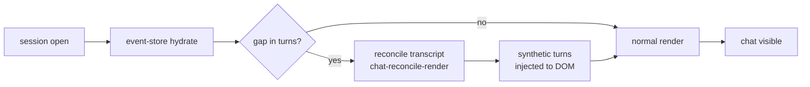

Three independent additions to the chat session layer, bundled because they share the same event-store and statusbar plumbing.

**Chat recovery:** Sessions now reconcile the transcript on open to surface turns dropped before `turn_usage` fired. `/close` falls back to a registry-poll path when the usage event is lost.

**Statusbar git popovers:** Branch and commit chips are now clickable - git info is fetched via a new `git.rs` IPC command and displayed in a popover overlay.

**PR preview card:** A modal in the chat pane previews a PR before creation - rendered body, commit list, and metadata parsed from `cc-pr-*` markers emitted by `/create-pr`.

Detail

- `event-store.ts` owns cross-turn deduplication; `chat-reconcile-render.test.mjs` covers the DOM-recovery path end-to-end.
- `close-finalize.ts` + `close-finalize.test.mjs` cover the registry-poll fallback for `/close`.
- `statusbar-popovers.ts` + `session-statusbar.css` handle popover render; `chat-click-handlers.ts` routes the click events.
- `chat-transforms.ts` + `chat-classifiers.ts` parse `cc-pr-*` markers and build the preview card model.

**Verify:** Open a session and confirm dropped turns surface on load. Click the branch chip - popover should open with git info. Run `/create-pr` - modal card should appear with rendered body and commit list.

